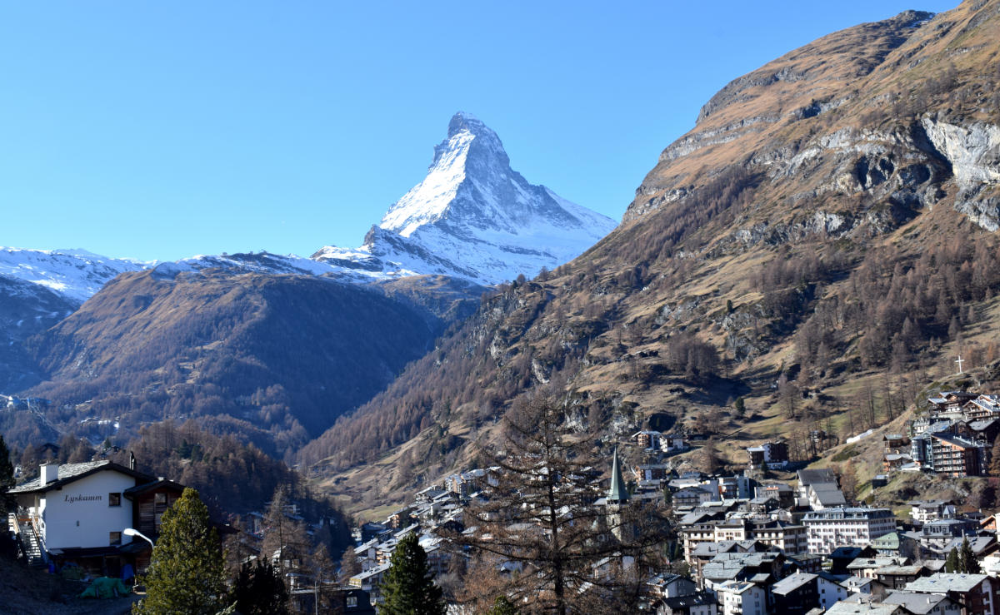
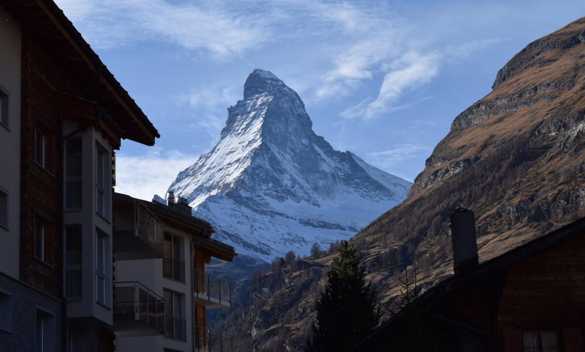

+++
title = "Zusammenspiel zwischen Natur & Industrie"
date = "2021-05-05"
draft = false
pinned = false
image = "gnaz.jpg"
description = "Eine Serie über den Kontrast zwischen der wunderschönen Natur und der weniger schönen Industrie."
+++
Ich starte die Serie um 08:00 Uhr Morgens mit einem Bild vom Matterhorn beim Sonnenaufgang. Der Berg und die Umgebung sieht sehr stimmig und ruhig aus.

Mein Ziel war es, die schöne Seite Zermatts ins Zusammenspiel mit der weniger schönen, industriellen Seite zu setzen. Im Vordergrund sieht man eine überbaute Stelle, währenddessen das Matterhorn im Hintergrund nicht vergessen geht. Die Bauarbeiter hatten um 12:30 Uhr vermutlich gerade Pause, so dass ich dieses Bild ungestört schiessen konnte

Auf folgendem Bild sieht man eine der typischen Sommerbaustellen. Wenn es warm ist wird alles für die kommende Wintersaison vorbereitet, wie hier bei dem Hotel "Cervo", wo gerade einen äusseren Spabereich gebaut wird. Dieses industrielle Sujet wurde um 15:00 Uhr geschossen.

Um den Tag noch einmal zusammen zu fassen und ein Gesamtbild des Dorfes zu bekommen, bin ich mit meinem Fahrrad ein bisschen den Berg hinauf gefahren. Der Anblick hat mich beeindruckt und ich finde man bekommt ein schönes und auch ein bisschen ein anderes Bild von Zermatt als normalerweise. Normalerweise sieht man auf den Postkarten und in den Werbungen bloss das schöne Horn und nicht, was rund herum passiert.

Meine Reise durch das weltweit bekannte Dorf nimmt langsam ein Ende. Nachfolgend bin ich jedoch noch einmal zu dem Ort gegangen, an dem ich das erste Bild früh Morgens geschossen habe. Hier habe ich die selben Einstellungen mit der selben Höhe des Stativs verwendet, bloss etwa 8.5 Stunden später.

