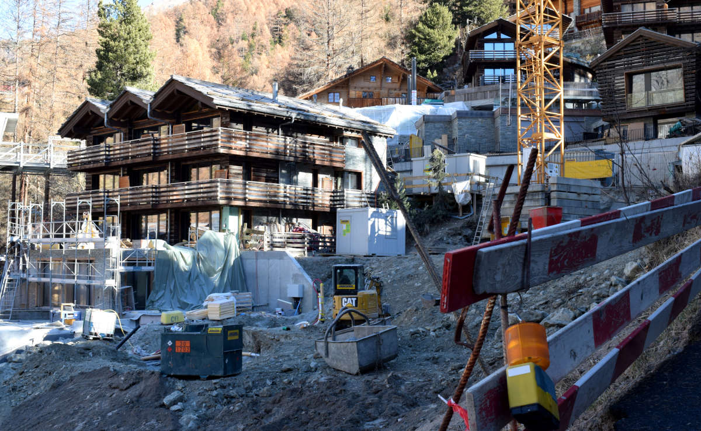

+++
title = "Zusammenspiel zwischen Natur & Industrie"
date = "2021-02-24"
draft = false
pinned = false
image = "gnaz.jpg"
description = "Eine Serie über den Kontrast zwischen der wunderschönen Natur und der weniger schönen Industrie."
+++
ich starte die Serie um 08:00 Uhr Morgens mit einem Bild vom Matterhorn beim Sonnenaufgang. Der Berg und die Umgebung sieht sehr stimmig und ruhig aus.

Mein Ziel war es, die schöne Seite Zermatts ins Zusammenspiel mit der weniger schönen, industriellen Seite zu setzen. Im Vordergrund sieht man eine überbaute Stelle, währenddessen das Matterhorn im Hintergrund nicht vergessen geht. Dieses Bild wurde am selben Tag um 14:30 Uhr geschossen.

Auf folgendem Bild sieht man eine der typischen Sommerbaustellen. Wenn es warm ist wird alles für die kommende Wintersaison vorbereitet, wie hier bei dem Hotel "Cervo", wo gerade einen äusseren Spabereich gebaut wird. Dieses industrielle Sujet wurde um 13:00 Uhr geschossen.

Nachfolgend bin ich noch einmal zu dem Ort gegangen, an dem ich das erste Bild früh Morgens schoss. Hier haben wir die selben Einstellungen mit der selben Höhe des Stativs, bloss etwa sieben Stunden später.

